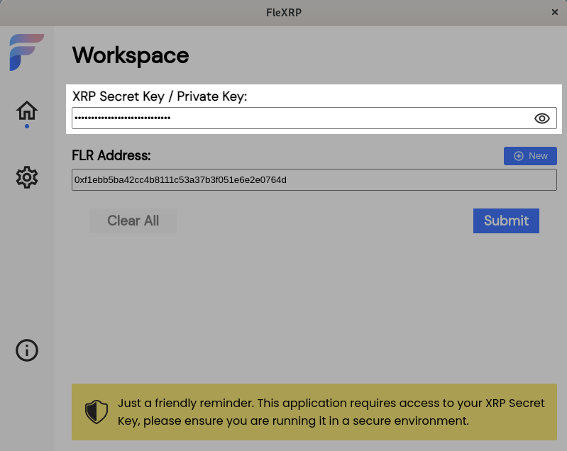
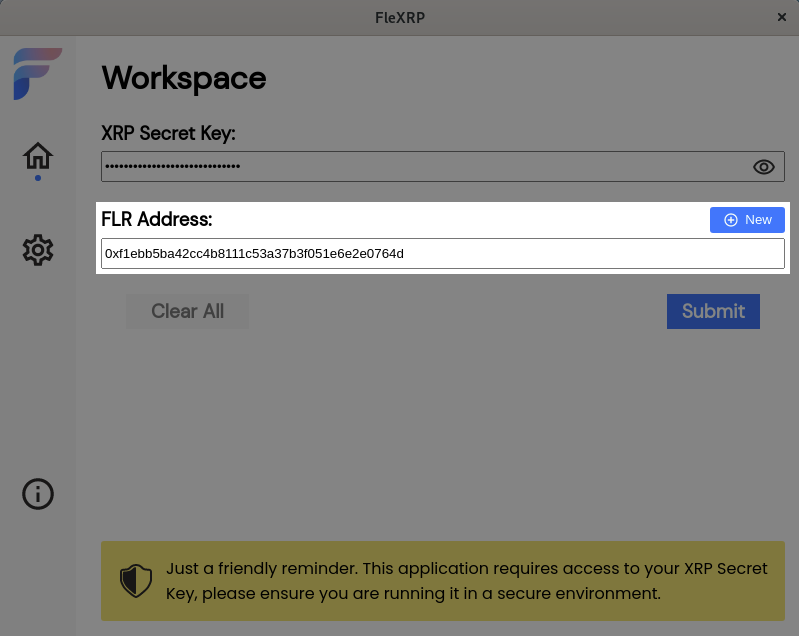
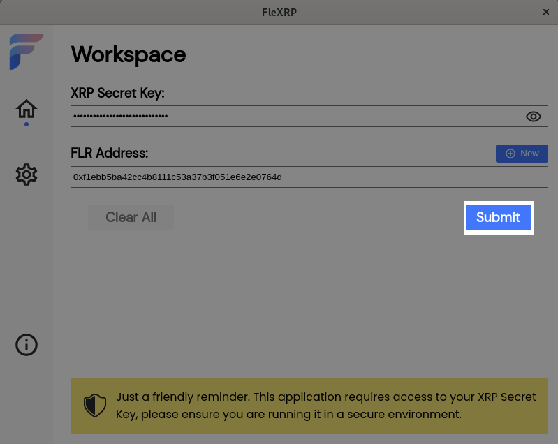

# Flexrp - Flare / XRP Account Setup Tool

This application will setup a XRP account for the Flare Spark token airdrop.

(C) 2020 - Dev Null Productions <devnullproductions@gmail.com>

## Installation

Download and run the following:

- On Windows: [flexrp.exe](https://github.com/DevNullProd/flexrp/raw/main/dist/flexrp-1.0.1.exe)
- On MacOS: [flexrp.dmg](https://github.com/DevNullProd/flexrp/raw/main/dist/flexrp-1.0.1.dmg)
- On RedHat/Fedora Linux: [flexrp.rpm](https://github.com/DevNullProd/flexrp/raw/main/dist/flexrp-1.0.1.x86_64.rpm)
- On Ubuntu/Debian Linux: [flexrp.deb](https://github.com/DevNullProd/flexrp/raw/main/dist/flexrp_1.0.1_amd64.deb)

MacOS support coming soon!

Once installed run the **flexrp** app to use this tool.

## Warning

**THIS TOOL REQUIRES ACCESS TO YOUR SECRET XRP KEY, ONLY RUN IT ON A SECURE SYSTEM**

Flexrp is 100% open source and auditable. Every effort has been made to make the code as transparent and easy to read and understand as possible.

While by default this tool runs in *online* mode, submitting the command to setup your wallet directly to the XRP ledger, it can be configured to run in *offline* mode for further security. See *settings* below

## Usage

Flexrp works via a simple one step process where you specify the secret key to your XRP account and the public address of the ETH wallet to associate with it.

If you do not have an existing Ethereum wallet, this tool will allow you to create one on the fly.

**IF YOU CREATE AN ETHEREUM WALLET, MAKE SURE TO STORE THE PRIVATE KEY. IT WILL NOT BE RECOVERABLE ONCE THE WINDOW IS CLOSED.**

To start launch the application and confirm you are running on a secure system:

Optionally click the settings icon in the upper right to configure application settings (see *settings* below).

Enter your XRP secret key here:

Click the *eye icon* to view / hide your XRP secret key.

Enter your ETH public address here:

Click the **+** icon to create a new ETH wallet, the existing one (if any) will be replaced. 

Finally click *Submit* to setup your account.

If operating in *offline* mode, you will be provided the XRP transaction to setup your account.

**YOU MUST SUBSEQUENTLY SUBMIT THIS TRANSACTION FOR IT TO TAKE EFFECT. THE SCOPE OF THIS IS OUTSIDE THIS TOOL**

If operation in *online* mode (default), the transaction will automatically submitted and confirmation presented.

You are now done! You will receive Flare Spark tokens on the date of the airdrop!

## Settings

Application settings can be configured by clicking the gears icons in the upper right.

- **Connect to testnet** - The XRPL testnet will be used instead of the mainnet. Read more about this [here](https://xrpl.org/parallel-networks.html)

- **Offline mode** - Flexrp will **not** connect to any XRP server and instead simply generate and sign a transaction for subsequent submission to the network. **YOU MUST INDEPENDENTLY SUBMIT THE PRODUCED TRANSACTION TO RECEIVE FLARE TOKENS**.

- **Specify XRP Account to setup** - Allows you to explicitly set the XRP account to setup if different than the one corresponding to the secret key (which will be used to sign the transaction). Useful for the case where you are using a *RegularKeyPair* to sign transactions (see [this](https://xrpl.org/assign-a-regular-key-pair.html) for more info).

When in offline mode, you will be required to configure a few more parameters to successfully be able to generate a XRP transaction. These are:

- **Fee** - the amount of XRP to pay in fees
- **Sequence** - the sequence number to assign to the transaction
- **Max Ledger Version** - the highest ledger number which this transaction can be included in

Read more about these options [here](https://xrpl.org/rippleapi-reference.html#transaction-instructions).

## Running from source

Flexrp is based on [electronjs](https://www.electronjs.org/). You will need to install [nodejs](https://nodejs.org/en/) and the [yarn](https://yarnpkg.com/) package manager to run it (outside the scope of this documentation.)

After checking out this project from github, run the **yarn** command to install dependencies followed by **yarn start** to start the application.

## Legaleeze

This application provides with no warranties or guarantees pertaining to functionality or use. Make sure you know what you are doing and the risks involved with managing cryptocurrencies before using this application. By using this application you agree to absolve Dev Null Productions of any liabilities that may arise.
